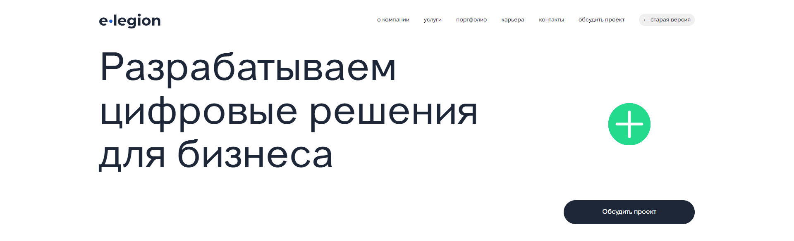
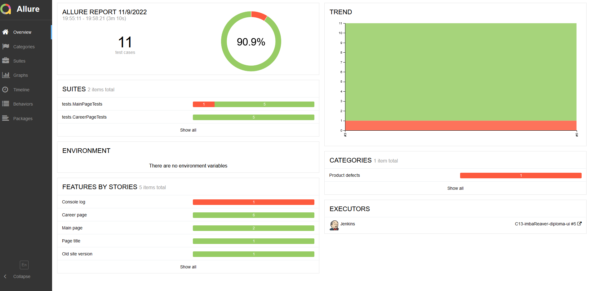
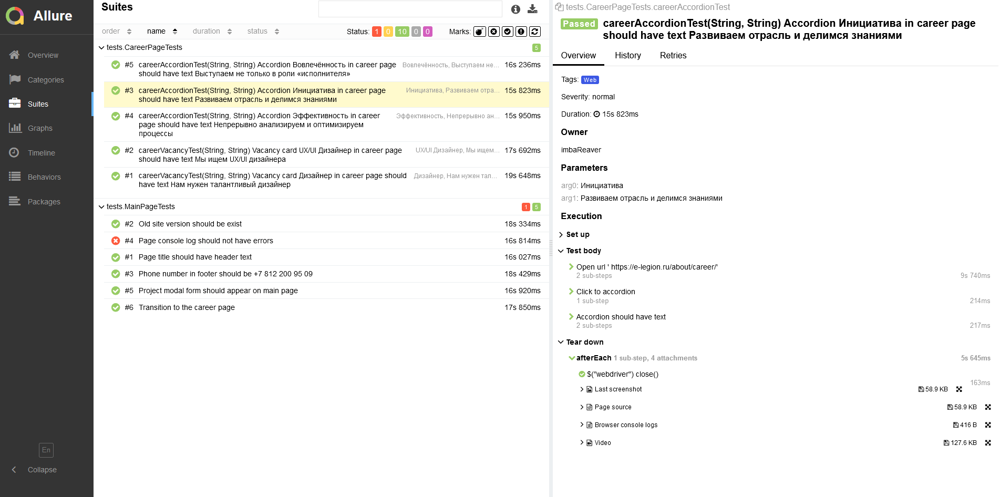
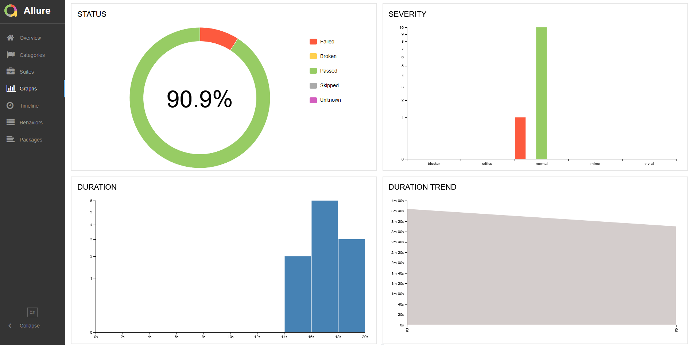
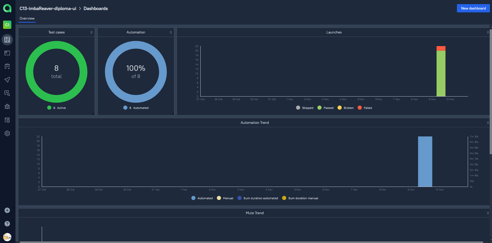
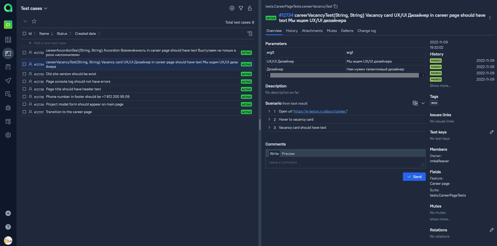
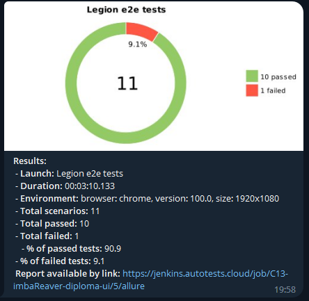
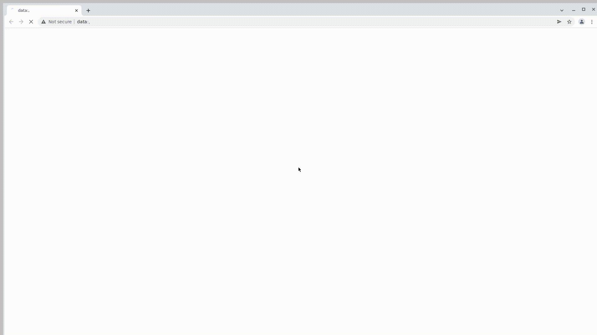

<h2 align="center"> Проект по автоматизации тестирования сайта <a target="_blank" href="https://e-legion.ru/">e-legion </a> </h2>

<a target="_blank" href="https://e-legion.ru/">
<p align="center">
  
</p></a>

## :green_book:	Содержание


> ➠ [Стек технологий](#classical_building-стек-технологий)
>
> ➠ [Реализованные проверки](#earth_africa-реализованные-проверки)
>
> ➠ [Запуск тестов из терминала](#запуск-тестов-из-терминала)
>
> ➠ [Запуск тестов из Jenkins](#запуск-тестов-из-jenkins)
>
> ➠ [Отчет о результатах тестирования в Allure Report](#skier-главная-страница-allure-отчета)
>
> ➠ [Интеграция с Allure TestOps](#интеграция-с-allure-testops)
> 
> ➠ [Уведомления в Telegram с использованием бота](#-уведомления-в-telegram-с-использованием-бота)
>
> ➠ [Пример запуска теста в Selenoid](#-пример-запуска-теста-в-selenoid)


## :classical_building: Стек технологий

<p align="center">


</p>

В данном проекте автотесты написаны на <code>Java</code> с использованием <code>Selenide</code> для UI-тестов.
>
> <code>Selenoid</code> выполняет запуск браузеров в контейнерах <code>Docker</code>.
>
> <code>Allure Report</code> формирует отчет о запуске тестов.
>
> Для автоматизированной сборки проекта используется <code>Gradle</code>.
>
> В качестве библиотеки для модульного тестирования используется <code>JUnit 5</code>.
>
> <code>Jenkins</code> выполняет запуск тестов.
> После завершения прогона отправляются уведомления с помощью бота в <code>Telegram</code>.

## :earth_africa: Реализованные проверки

> Разработаны автотесты на <code>UI</code>.
### UI

- [x] Проверка заголовка главной страницы
- [x] Проверка ошибок в консоли
- [x] Проверка открытия формы обратной связи
- [x] Проверка номера телефона в футере
- [x] Проверка перехода на страницу карьеры
- [x] Проверка перехода на старую версию сайта
- [x] Проверка текста в аккордеоне
- [x] Проверка текста в карточке вакансии

## Запуск тестов из терминала

### :robot: Локальный запуск тестов с файлом local.properties

```
gradle clean test 
-Dhost=local
```
### :robot: Локальный запуск тестов без файла local.properties

```
gradle clean test 
-Dhost=local
-Dbrowser=${BROWSER}
-DbrowserVersion=${BROWSER_VERSION}
-DbrowserSize=${BROWSER_SIZE}
```

### :robot: Удаленный запуск тестов с файлом remote.properties

```
gradle clean test
-Dhost=remote
```
### :robot: Удаленный запуск тестов без файла remote.properties

```
gradle clean test
-Dhost=remote
-Dbrowser=${BROWSER}
-DbrowserVersion=${BROWSER_VERSION}
-DbrowserSize=${BROWSER_SIZE}
-DremoteDriverUrl=https://user1:1234@${REMOTE_DRIVER_URL}/wd/hub/
-DvideoStorage=https://${REMOTE_DRIVER_URL}/video/
-Dthreads=${THREADS}
```
## Запуск тестов из Jenkins

### :robot: Параметры сборки

> <code>REMOTE_URL</code> – адрес удаленного сервера, на котором будут запускаться тесты.
>
> <code>BROWSER</code> – браузер, в котором будут выполняться тесты (_по умолчанию - <code>chrome</code>_).
>
> <code>BROWSER_VERSION</code> – версия браузера, в которой будут выполняться тесты (_по умолчанию - <code>91.0</code>_).
>
> <code>BROWSER_SIZE</code> – размер окна браузера, в котором будут выполняться тесты (_по умолчанию - <code>1920x1080</code>_).

<a target="_blank" href="https://jenkins.autotests.cloud/job/C13-imbaReaver-diploma-ui/">**Сборка в Jenkins**</a>

<p align="center">
  
</p>

## Отчет в Allure Report
### :skier: Главная страница Allure-отчета

<p align="center">

</p>

### :eye_speech_bubble: Тест-кейсы

<p align="center">

</p>


### :frog: Основной дашборд

<p align="center">

</p>

## Интеграция с Allure TestOps
<a target="_blank" href="https://allure.autotests.cloud/launch/16554/tree?treeId=0">**Проект в TestOps**</a>
### :skier: Дашборд Allure TestOps

<p align="center">

</p>

### :eye_speech_bubble: Тест-кейсы

<p align="center">

</p>


##  Уведомления в Telegram с использованием бота

> После завершения сборки специальный бот, созданный в <code>Telegram</code>, автоматически обрабатывает и отправляет сообщение с отчетом о прохождении тестов.

<p align="center">

</p>

##  Пример запуска теста в Selenoid

> К каждому тесту в отчете прилагается видео. Одно из таких видео представлено ниже.
<p align="center">
  
</p>


